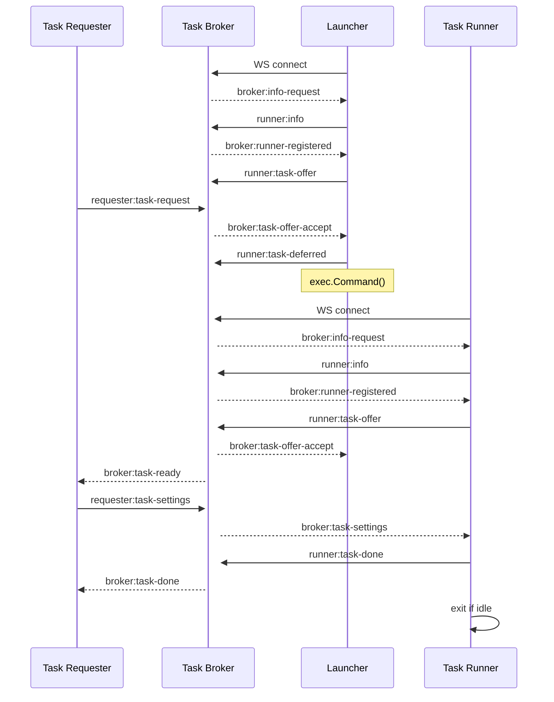

# Lifecycle

## Summary

The purpose of the launcher is to minimize resource use by launching a runner on demand. To do so, the launcher impersonates a task runner until a task is ready for pickup, and then it launches a runner to run the task, and after the runner has automatically shut down, the launcher will re-launch a runner to pick up the next task.

## Step by step

Once the launcher is started, it connects to the n8n instance via HTTP and then via websocket, registers itself as a runner with the task broker, and sends the task broker a non-expiring offer to run a task.

This flow is called the **handshake**. The handshake will complete only when a task needs to be run, i.e. only once the task broker sends the launcher (registered as a runner) the broker's acceptance of the launcher's offer to run a task.

The launcher itself cannot run a task, so once the launcher receives an acceptance from the broker, the launcher requests the broker to defer the task, disconnects from the task broker, and launches a task runner as a separate process.

This runner will follow the regular flow, i.e. connect to the main instance, register itself with the task broker, and send the task broker expiring offers to run tasks. The broker will match one of those offers to the pending (deferred) task, and so the task broker will send the runner the task to run.

The runner will receive and complete the task and return the result. By now only the runner is connected with the task broker, so when the next task comes in, the runner will receive and complete the next task. Once the runner has been idle for long enough, the runner will automatically shut down, prompting the launcher to perform the handshake again. Later on, when the next task comes in, the launcher will complete the handshake and the cycle will repeat.

### Sequence diagram

